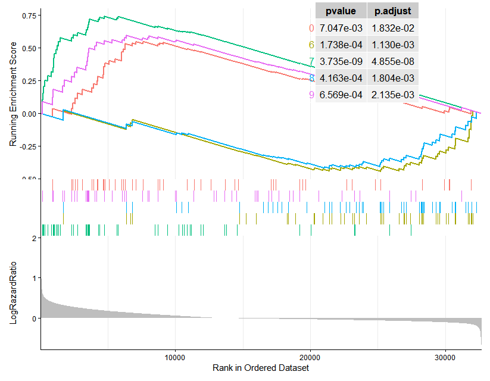

# HazardGeneEnrichment

## Introduction

HazardGeneEnrichment is an R package designed to perform Hazard Ratio-based Gene Set Enrichment Analysis (GSEA) by integrating single-cell RNA sequencing (scRNA-seq) data with Cancer Genome Atlas (TCGA) survival data. This package provides a suite of functions to identify single-cell cluster-specific marker genes and assess the association of these gene sets with prognostic risk in TCGA cancer cohorts.
Objectives
To identify cell cluster-specific marker genes from single-cell RNA sequencing data.
To rank genes in TCGA cancer cohorts based on their Hazard Ratios.
To perform GSEA on single-cell marker gene sets to explore their association with cancer patient survival prognosis.
To visualize GSEA results, including enrichment plots and key statistical data.

## Installation

You can install the HazardGeneEnrichment package from GitHub using devtools:

If devtools is not already installed
```install.packages("devtools")```
``` devtools::install_github('leiwen7788/HazardGeneEnrichment') ```

## Dependencies

The HazardGeneEnrichment package relies on the following CRAN and Bioconductor packages. devtools should automatically install these dependencies when you install HazardGeneEnrichment.
tidyverse (for data manipulation, including dplyr and ggplot2)
clusterProfiler (for core GSEA functionalities)
gridExtra (for plot arrangement)
Package Functions Overview
The HazardGeneEnrichment package primarily offers the following core functionalities:

* display_genesets(): Displays a list of TCGA cancer types supported for analysis by this package.
* HazardEnrichment(): The main function to execute Hazard Ratio-based GSEA.
* gseaplot_hazard(): Plots GSEA enrichment curves, with an option to include a p-value table.

## Detailed Usage Workflow

This section will detail how to use the HazardGeneEnrichment package and reproduce the analysis workflow you've demonstrated in your code.

### 1. Load Necessary Libraries

```
# Load your developed package
library(HazardGeneEnrichment) 
# Load other dependency packages
library(tidyverse)
library(clusterProfiler)
library(gridExtra) # For combining plots
```

### 2. Prepare Input Data

You will need to prepare a marker gene table from single-cell RNA sequencing data, along with gene expression and clinical survival data from a TCGA cancer cohort.

#### 2.1 Load Marker Gene Table

The marker table contains differentially expressed genes identified from single-cell data. We assume it has been pre-processed to include columns like cluster and avg_log2FC.

```
# Load the marker gene table from the specified path
# This file is assumed to contain marker gene information for various single-cell clusters
marker <- read.table('all.diffgene_onlypos_padj005.txt',
                     header = TRUE, # Adjust based on your file's actual header status
                     sep = "\t")    # Adjust based on your file's actual separator
```                     
#### 2.2 Load Single-Cell Gene List

This is a list of all genes present in your single-cell dataset, which will be used as the background gene set for GSEA.

```
# Extract all gene names from the Seurat object
seuratobj <- readRDS('seuratObject.rds')
singlecell_gene <- rownames(seuratobj)

# Ensure singlecell_gene is a character vector
if (!is.character(singlecell_gene)) {
  `singlecell_gene <- as.character(singlecell_gene)
}
```

#### 2.3 Filter Top 50 Marker Genes per Cluster
This step prepares the gene sets for GSEA enrichment analysis. We select the top 50 genes with the highest avg_log2FC for each cell cluster.

```
top50_markers <- marker %>%
  dplyr::group_by(cluster) %>%
  dplyr::slice_max(n = 50, order_by = avg_log2FC)

# View a portion of the filtered marker genes
head(top50_markers)
```

#### 2.4 Format Gene Set Data (TERM2GENE)

GSEA tools like clusterProfiler typically require gene set data in a specific format: a data frame with two columns, term and gene. The term column represents the gene set name (here, the cell cluster name), and the gene column represents the gene ID.

```
TERM2GENE <- top50_markers[, c('cluster', 'gene')]
colnames(TERM2GENE) <- c('term', 'gene')
TERM2GENE <- as.data.frame(TERM2GENE)

# Ensure the gene column is of character type to prevent subsequent matching issues
TERM2GENE$gene <- as.character(TERM2GENE$gene)

# View a portion of the formatted gene set data
head(TERM2GENE)
```

### 3. View Available TCGA Cancer Cohorts

The display_genesets() function shows a list of TCGA cancer types that HazardGeneEnrichment package supports for analysis.

```
# List all supported TCGA cancer cohorts
display_genesets()
```

Example output:
* TCGA-ACC: Adrenocortical Carcinoma (肾上腺皮质癌)
A rare cancer that forms in the outer layer of the adrenal glands (adrenal cortex).
* TCGA-BLCA: Bladder Urothelial Carcinoma (膀胱尿路上皮癌)
Cancer that begins in the urothelial cells that line the bladder.
* TCGA-BRCA: Breast Invasive Carcinoma (乳腺浸润性癌)
The most common type of breast cancer, where cancer cells have broken through the milk ducts or lobules and invaded surrounding breast tissue.
* TCGA-CESC: Cervical Squamous Cell Carcinoma and Endocervical Adenocarcinoma (宫颈鳞状细胞癌和宫颈内腺癌)
Cancers originating in the cervix, encompassing both squamous cell carcinoma (most common) and adenocarcinoma.
* TCGA-CHOL: Cholangiocarcinoma (胆管癌)
A rare cancer that forms in the bile ducts, which are tubes that carry digestive fluid (bile) from the liver to the small intestine.
* TCGA-COAD: Colon Adenocarcinoma (结肠腺癌)
A type of cancer that begins in the glandular cells of the colon, which are responsible for producing mucus. It's a common form of colorectal cancer.
* TCGA-DLBC: Lymphoid Neoplasm Diffuse Large B-cell Lymphoma (淋巴样肿瘤弥漫大B细胞淋巴瘤)
A fast-growing type of non-Hodgkin lymphoma that affects B lymphocytes.
* TCGA-ESCA: Esophageal Carcinoma (食管癌)
Cancer that forms in the esophagus, the hollow, muscular tube that connects the throat to the stomach. It includes both squamous cell carcinoma and adenocarcinoma of the esophagus.
* TCGA-GBM: Glioblastoma Multiforme (胶质母细胞瘤)
An aggressive type of cancer that can form in the brain or spinal cord. It's one of the most common and deadliest primary brain tumors in adults.
* TCGA-HNSC: Head and Neck Squamous Cell Carcinoma (头颈部鳞状细胞癌)
Cancers that start in the squamous cells that line the moist surfaces inside the head and neck (e.g., mouth, throat, voice box).
* TCGA-KICH: Kidney Chromophobe (肾嫌色细胞癌)
A relatively rare subtype of kidney cancer, originating in the kidney's epithelial cells. It generally has a better prognosis than other kidney cancer types.
* TCGA-KIRC: Kidney Renal Clear Cell Carcinoma (肾透明细胞癌)
The most common type of kidney cancer (renal cell carcinoma), characterized by clear-looking cells under a microscope.
* TCGA-KIRP: Kidney Renal Papillary Cell Carcinoma (肾乳头状细胞癌)
Another subtype of kidney cancer, often growing in a finger-like or "papillary" pattern.
* TCGA-LAML: Acute Myeloid Leukemia (急性髓系白血病)
A fast-growing cancer of the blood and bone marrow, characterized by the rapid growth of abnormal myeloid cells.
* TCGA-LGG: Brain Lower Grade Glioma (脑低级别胶质瘤)
A group of less aggressive brain tumors compared to glioblastoma, but they can still be serious and may progress over time.
* TCGA-LIHC: Liver Hepatocellular Carcinoma (肝细胞癌)
The most common type of primary liver cancer, originating in the main type of liver cell (hepatocyte).
* TCGA-LUAD: Lung Adenocarcinoma (肺腺癌)
A common type of non-small cell lung cancer that begins in the cells that line the alveoli (air sacs) and produce substances like mucus.
* TCGA-LUSC: Lung Squamous Cell Carcinoma (肺鳞状细胞癌)
Another common type of non-small cell lung cancer that starts in the flat, scale-like cells that line the inside of the airways in the lungs.
* TCGA-MESO: Mesothelioma (间皮瘤)
A rare and aggressive cancer that originates in the lining of the lungs, abdomen, or heart, often linked to asbestos exposure.
* TCGA-OV: Ovarian Serous Cystadenocarcinoma (卵巢浆液性囊腺癌)
The most common and aggressive type of epithelial ovarian cancer.
* TCGA-PAAD: Pancreatic Adenocarcinoma (胰腺腺癌)
The most common type of pancreatic cancer, originating in the glandular cells of the pancreas. It's known for being aggressive and often diagnosed at late stages.
* TCGA-PCPG: Pheochromocytoma and Paraganglioma (嗜铬细胞瘤和副神经节瘤)
Rare tumors that form in cells that produce hormones like adrenaline. Pheochromocytomas occur in the adrenal glands, while paragangliomas occur outside the adrenal glands.
* TCGA-PRAD: Prostate Adenocarcinoma (前列腺腺癌)
Cancer that forms in the gland cells of the prostate, a gland in the male reproductive system. It is one of the most common cancers in men.
* TCGA-READ: Rectum Adenocarcinoma (直肠腺癌)
A type of cancer that begins in the glandular cells of the rectum, the final section of the large intestine. It's also a form of colorectal cancer.
* TCGA-SARC: Sarcoma (肉瘤)
A broad category of cancers that arise from connective tissues (like bone, cartilage, fat, muscle, blood vessels, or other soft tissues).
* TCGA-SKCM: Skin Cutaneous Melanoma (皮肤黑色素瘤)
A serious form of skin cancer that begins in melanocytes, the cells that produce the pigment melanin.
* TCGA-STAD: Stomach Adenocarcinoma (胃腺癌)
Cancer that forms in the glandular cells of the stomach lining.
* TCGA-TGCT: Testicular Germ Cell Tumors (睾丸生殖细胞瘤)
Cancers that start in the germ cells of the testicles, which are responsible for producing sperm. These are the most common cancers in young men.
* TCGA-THCA: Thyroid Carcinoma (甲状腺癌)
Cancer that forms in the tissues of the thyroid gland, which is located at the base of the neck and produces hormones.
* TCGA-THYM: Thymoma and Thymic Carcinoma (胸腺瘤和胸腺癌)
Rare tumors that originate in the thymus gland, a small organ located behind the breastbone that plays a role in the immune system.
* TCGA-UCEC: Uterine Corpus Endometrial Carcinoma (子宫内膜癌)
Cancer that forms in the tissues of the endometrium (the lining of the uterus). It's the most common type of uterine cancer.
* TCGA-UCS: Uterine Carcinosarcoma (子宫癌肉瘤)
A rare and aggressive type of uterine cancer that contains both cancerous epithelial (carcinoma) and stromal (sarcoma) components.
* TCGA-UVM: Uveal Melanoma (葡萄膜黑色素瘤)
A rare form of melanoma that develops in the uvea, the middle layer of the eye.
* NB(GSE85047): Neuroblastoma (神经母细胞瘤) (Data from GSE85047, a Gene Expression Omnibus dataset)
A cancer that develops from immature nerve cells found in several areas of the body, most commonly in the adrenal glands. It primarily affects infants and young children. (The GSE85047 indicates the specific dataset from which this data is sourced, rather than being part of the cancer type name itself.)
These are the values you can pass to the TCGA_cancer_type argument of the HazardEnrichment function.

### 4. Perform Hazard Ratio-based GSEA

Now, we can use the HazardEnrichment() function to perform GSEA for a specific TCGA cancer cohort. In this example, we select TCGA-HNSC (Head and Neck Squamous Cell Carcinoma).

```
# Execute Hazard Ratio-based GSEA
# TCGA_cancer_type: Specifies the TCGA cancer type to analyze, e.g., "TCGA-HNSC"
# TERM2GENE: The formatted gene set data frame
# pvalueCutoff: The p-value threshold for GSEA
# singlecell_gene: The background list of all single-cell genes, used for filtering
my_gsea_results <- HazardEnrichment(TCGA_cancer_type = 'TCGA-HNSC',
                                  TERM2GENE = TERM2GENE,
                                  pvalueCutoff = 0.05,
                                  singlecell_gene = singlecell_gene)

# View summary of GSEA results
summary(my_gsea_results)

# View the gene set IDs (cluster names) from the GSEA results
unique(my_gsea_results@result$ID)
```

### 5. Visualize GSEA Results

Use the gseaplot_hazard() function to draw the GSEA enrichment curves. You can choose to plot all significantly enriched gene sets or specify particular gene set IDs.

```
# Plot all significantly enriched gene sets
# geneSetID = unique(my_gsea_results@result$ID) will plot all gene sets present in the results
# pvalue_table = TRUE will include a table of p-values and q-values in the plot
gseaplot_hazard(my_gsea_results,
                geneSetID = unique(my_gsea_results@result$ID),
               pvalue_table = TRUE)
```


## Interpretation of Results

The GSEA enrichment plot (output of gseaplot_hazard) will show the distribution of each single-cell cluster (as a gene set) within the gene list ranked by Hazard Ratio.
Peak of the Enrichment Curve:
If the peak appears at the front of the ranked gene list (Running Enrichment Score > 0), it indicates that the marker genes of that cell cluster are associated with a high Hazard Ratio (i.e., worse prognosis).
If the peak appears at the back of the ranked gene list (Running Enrichment Score < 0), it indicates that the marker genes of that cell cluster are associated with a low Hazard Ratio (i.e., better prognosis).
P-value and q-value (FDR): These values (typically shown in the legend or a table) are used to determine the statistical significance of the enrichment. A qvalue < 0.25 or qvalue < 0.05 is usually considered significant enrichment.
Through this analysis, you can identify which single-cell subpopulations' molecular characteristics (represented by their marker genes) are significantly associated with the survival prognosis of patients in specific cancer types.

## License

GPL-3
